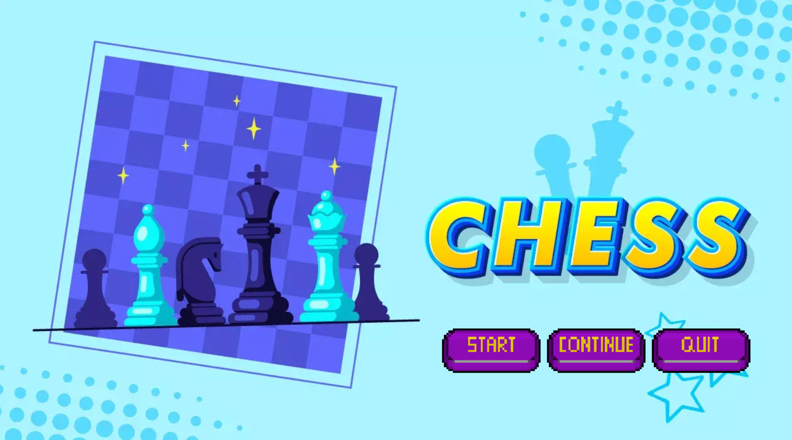
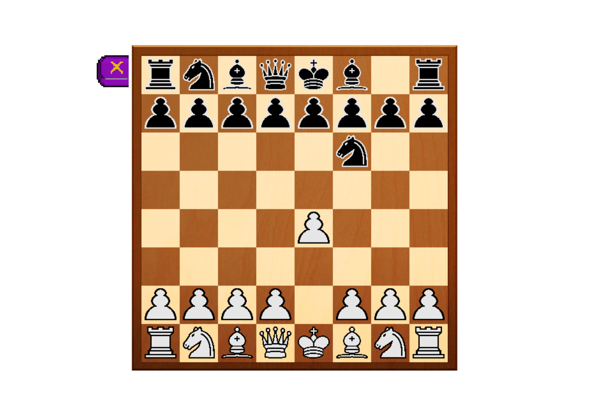

# Chess
## Bài tập lớn 2324INT2215_52
##### *Đỗ Chí Long - 23020679*

- Video: https://youtu.be/ktTQBGBmt1E

# Giới thiệu game

Chess là môn cờ vua cổ điển, được chơi bởi hai người chơi với mục tiêu chiếu hết được quân Vua của đối phương

- [0. Cách tải game](#0-cách-tải-game)
    * [a. Cách 1: Không bao gồm code.](#a-cách-1-không-bao-gồm-code)
    * [b. Cách 2: Bao gồm code và có thể biên dịch.](#b-cách-2-bao-gồm-code-và-có-thể-biên-dịch)
- [1. Bắt đầu game](#1bắt-đầu-game)
- [2. Các thành phần trong game:](#2-các-thành-phần-trong-game)
- [3. Cách chơi](#3-cách-chơi)
- [4. Chiến thắng và thất bại](#4-chiến-thắng-và-thất-bại)
- [Về đồ họa của game:](#về-đồ-họa-của-game)
- [Về source code game](#về-source-code-game)

# 0. Cách tải game

## a. Cách 1: Không bao gồm code.

Tải game (được nén thành .zip) tại link
sau:  
Cách này tiết kiệm bộ nhớ và thời gian tải đi rất nhiều (khoảng 25MB). 
Giải nén game vào một thư mục và bật sad.exe lên và chơi. 

## b. Cách 2: Bao gồm code và có thể biên dịch.

**Bước 1:** Clone repo này về.  
Hoặc Chọn Code -> Download Zip
- Tất cả code đều nằm trong thư mục src. 
- Có thể nhảy đến bước 4 để chơi luôn.

**Bước 2:** Cài mingw. Ở đây mình cài đặt phiên bản MinGW-W64
GCC-8.1.0 [x86_64-posix-seh](https://sourceforge.net/projects/mingw-w64/files/Toolchains%20targetting%20Win64/Personal%20Builds/mingw-builds/8.1.0/threads-posix/seh/x86_64-8.1.0-release-posix-seh-rt_v6-rev0.7z/download). 

**Bước 3:** Cài CodeBlock

**Bước 4:** Mở file cbp và gõ F9 hoặc chạy file sad.exe

# 1. Bắt đầu game

* Chờ một chút rồi click vào nút “START” để bắt đầu chơi game.

* Nếu có ván đấu còn dở hãy bấm nút "CONTINUE" để tiếp tục game đấu đó.

# 2. Các thành phần trong game:

* Các quân cờ, gồm trắng và đen đã có các hàm logic nhất định
* Nút Return trở lại Menu chính

# 3. Cách chơi
* Dùng chuột di chuyển các quân cờ, nếu di chuyển không đúng theo luật cờ vua thì quân cờ sẽ không di chuyển. Luật cờ vua có thể được xem dưới link sau:
**https://vietnamchess.vn/index.php/experience-news/lawofchess/lawofchess2018**

# 4. Chiến thắng và thất bại

* Game chưa set up được logic chiếu hết/hòa của cờ vua

### Về đồ họa của game:
Nguồn của âm thanh và hình ảnh được chủ yếu lấy từ đồ họa của
chess.com:             https://www.chess.com/ 

### Về source code game:

- Folder ChessPieces: Chứa tất cả các quân cờ
    * Piece: Class xử lý chung (vị trí, bị ăn, hình ảnh)
    * Pawn, Rook, ... : Class con của Piece, xử lí logic cơ bản của việc di chuyển
- EventManager: Sử lí các event thông thường
- Map: Giao diện chính của bàn cờ, xử lí một số logic của cờ vua, lưu vị trí của từng quân cờ
- GameObject: Xử lí hình ảnh quân cờ
- Menu: xử lí giao diện Menu
- game.hpp và game.cpp: xử lí logic chuột và âm thanh, file chính để game hoạt động
- main.cpp: hàm main() của game